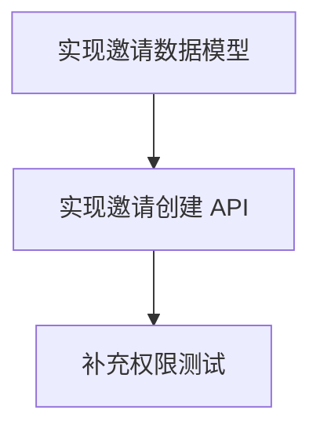

# 项目上下文编译器 MVP Spec

## 1. 产品目标

实现一个 Web 应用：

用户上传已有项目资料，系统使用 LLM-first 方式读取资料，抽取内容证据块、需求事实、业务规则、决策、风险、阻塞、未决问题，并生成候选需求对象。

候选需求对象必须经过人工审核。只有审核通过的需求，才能生成 Symphony 可编排的 agent-ready 任务。

核心流程：

```text
资料 → ContentBlock → Claim → 候选 Requirement → 人工审核 → Approved Requirement → Task DAG → Symphony Markdown
```

基本原则：

```text
LLM 读取 = 内容候选
LLM 抽取 = 需求提案
人工审核 = 需求承诺
Symphony 执行 = 工程实现
```

系统必须支持资料不完整、格式不统一、来源不固定的情况。

---

## 2. MVP 核心定位

这是一个：

```text
LLM-first, evidence-grounded, human-gated requirement compiler
```

中文定义：

```text
LLM 优先读取、证据驱动、人工闸门控制的需求编译器
```

系统不要求用户提供完整资料。用户可以只上传会议记录、Excel、文档、聊天记录、ASR 文本中的任意一种或多种。

资料越多，生成的需求越完整；资料不足时，系统必须标记：

```text
置信度
缺失信息
假设
未决问题
冲突
需要人工确认的点
```

---

## 3. 技术栈

后端：

```text
.NET 10
ASP.NET Core Web API
EF Core 10
PostgreSQL
Npgsql
FluentValidation
Serilog
OpenAPI / Swagger
```

前端：

```text
React
Vite
TypeScript
React Router
TanStack Query
Tailwind CSS
React Flow
```

本地环境：

```text
Docker Compose
PostgreSQL
本地文件存储 /storage
```

结构化生成 Provider：

```text
统一接口：IStructuredGenerationProvider

MVP 实现：
- MockStructuredGenerationProvider
- LocalCodexCliProvider

未来实现：
- OpenAiApiProvider
- AzureOpenAiProvider
- LocalModelProvider
```

---

## 4. MVP 范围

### 4.1 必做

1. 创建项目。
2. 上传任意资料文件。
3. 粘贴文本作为资料。
4. 保存原始文件。
5. 使用 LLM-first Artifact Reader 读取资料。
6. 生成 ContentBlock。
7. 从 ContentBlock 抽取 Claim。
8. 从 Claim 合成候选 Requirement。
9. 人工审核 Requirement。
10. 只有 Approved Requirement 才能生成任务。
11. 生成任务列表和依赖 DAG。
12. 导出 Symphony Markdown。
13. 保留证据引用、版本记录、模型运行记录。

### 4.2 MVP 支持的输入

MVP 阶段支持：

```text
.txt
.md
.csv
.xlsx
.docx
.pdf
粘贴文本
ASR 听录文本
企业微信手动导出文本
会议记录文本
```

注意：

```text
MVP 不要求程序完整解析所有格式。
系统采用 LLM-first 读取策略。
程序只做保存、类型识别、轻量文本提取、切片和 Provider 调用。
```

### 4.3 不做

MVP 不实现：

```text
企业微信 API 直连
会议录屏上传
内置 ASR
视频帧 OCR
Jira / Linear / GitHub 写入
多租户
复杂权限系统
真实 Symphony runtime 集成
自动启动 Codex agent 执行任务
```

---

## 5. 总体架构

```text
Artifact Intake
  ↓
Artifact Reader
  ↓
ContentBlock Extraction
  ↓
Claim Extraction
  ↓
Requirement Synthesis
  ↓
Requirement Review Gate
  ↓
Task Generation
  ↓
Symphony Markdown Export
```

职责边界：

```text
程序负责：
- 保存文件
- 识别类型
- 轻量提取文本
- 文件切片
- 调用 Provider
- 校验 JSON
- 落库
- 状态机
- 人工审核 Gate
- 导出

LLM / Codex 负责：
- 读取资料
- 识别内容块
- 抽取 Claim
- 合成候选 Requirement
- 生成候选 Task

人负责：
- 审核 Requirement
- 修改 Requirement
- 批准 / 拒绝 / 延期 / 要求澄清
```

禁止路径：

```text
LLM 读文件 → 直接生成 Symphony 任务
LLM 输出 → 直接 Approved
未审核 Requirement → 生成可执行任务
Codex → 直接写数据库
Codex → 直接修改业务状态
```

---

## 6. 仓库结构

```text
project-context-compiler/
  backend/
    src/
      Pcc.Api/
      Pcc.Application/
      Pcc.Domain/
      Pcc.Infrastructure/
    tests/
      Pcc.UnitTests/
      Pcc.IntegrationTests/
  frontend/
    src/
      api/
      components/
      features/
      pages/
      routes/
      types/
  docs/
    SPEC.md
    API.md
    DATA_MODEL.md
  docker-compose.yml
  README.md
```

项目职责：

```text
Pcc.Domain
  实体、枚举、领域规则

Pcc.Application
  DTO、UseCase、Validator、Provider 接口、业务服务接口

Pcc.Infrastructure
  EF Core、文件存储、轻量文本提取、Provider 实现、Exporter

Pcc.Api
  Controller / Minimal API、Swagger、中间件
```

---

## 7. 核心数据模型

### 7.1 Project

```csharp
class Project
{
    Guid Id;
    string Name;
    string? Description;
    DateTimeOffset CreatedAt;
    DateTimeOffset UpdatedAt;
}
```

---

### 7.2 Artifact

Artifact 是用户上传或粘贴的原始资料。

```csharp
class Artifact
{
    Guid Id;
    Guid ProjectId;
    string Title;
    ArtifactType Type;
    string? OriginalFileName;
    string? MimeType;
    string? FileExtension;
    string? StoragePath;
    string? Sha256;
    string? RawText;
    ArtifactReadStatus ReadStatus;
    string? ReadError;
    DateTimeOffset CreatedAt;
}
```

```csharp
enum ArtifactType
{
    Text,
    Markdown,
    Csv,
    Excel,
    Docx,
    Pdf,
    PastedText,
    AsrTranscript,
    MeetingNotes,
    ChatExport,
    Other
}
```

```csharp
enum ArtifactReadStatus
{
    Uploaded,
    Reading,
    Read,
    Failed,
    Unsupported
}
```

说明：

```text
Artifact 保存原始资料。
Artifact 不要求被程序完全解析。
Artifact 的内容读取结果落到 ContentBlock。
```

---

### 7.3 ContentBlock

ContentBlock 是 LLM-first 读取后的证据块，是后续 Claim 抽取的唯一输入。

```csharp
class ContentBlock
{
    Guid Id;
    Guid ProjectId;
    Guid ArtifactId;
    ContentBlockType Type;
    string Text;
    string? LocationLabel;
    int OrderIndex;
    decimal Confidence;
    string? MetadataJson;
    DateTimeOffset CreatedAt;
}
```

```csharp
enum ContentBlockType
{
    Paragraph,
    Table,
    List,
    ImageText,
    Diagram,
    TranscriptSegment,
    ChatMessage,
    RequirementRow,
    DecisionNote,
    Unknown
}
```

示例：

```json
{
  "type": "RequirementRow",
  "text": "邀请成员：仅管理员可操作，邮箱必填，重复邀请提示已存在",
  "locationLabel": "成员管理.xlsx / Sheet:成员管理 / Row:18",
  "confidence": 0.89
}
```

ContentBlock 规则：

```text
ContentBlock 阶段只允许转写、摘录、结构化文件内容。
ContentBlock 阶段不做需求判断。
ContentBlock 必须尽量包含 locationLabel。
没有 locationLabel 的 ContentBlock 置信度应降低。
```

---

### 7.4 Claim

Claim 是从 ContentBlock 中抽取的需求分析事实单元。

```csharp
class Claim
{
    Guid Id;
    Guid ProjectId;
    ClaimType Type;
    string Subject;
    string Text;
    decimal Confidence;
    decimal AmbiguityScore;
    decimal FreshnessScore;
    decimal SourceAuthorityScore;
    ClaimStatus Status;
    DateTimeOffset CreatedAt;
}
```

```csharp
enum ClaimType
{
    Requirement,
    BusinessRule,
    Decision,
    ActionItem,
    ChangeRequest,
    Blocker,
    Risk,
    Dependency,
    AcceptanceRule,
    OpenQuestion,
    Constraint,
    DeferredScope,
    OutOfScope,
    ImplementationHint,
    TestRequirement
}
```

```csharp
enum ClaimStatus
{
    Extracted,
    Merged,
    Ignored,
    Superseded
}
```

---

### 7.5 ClaimEvidence

Claim 必须引用 ContentBlock。

```csharp
class ClaimEvidence
{
    Guid Id;
    Guid ClaimId;
    Guid ContentBlockId;
    string EvidenceText;
}
```

规则：

```text
Claim 没有 ClaimEvidence 时不得进入 Requirement Synthesis。
```

---

### 7.6 Requirement

Requirement 是人工审核的核心对象。

```csharp
class Requirement
{
    Guid Id;
    Guid ProjectId;
    string Title;
    string Summary;
    string? Module;
    RequirementType RequirementType;
    RequirementStatus Status;
    decimal Confidence;
    int CurrentVersion;
    DateTimeOffset CreatedAt;
    DateTimeOffset UpdatedAt;
}
```

```csharp
enum RequirementType
{
    Functional,
    NonFunctional,
    Technical,
    BugFix,
    Refactor,
    Research,
    Test,
    Migration,
    Unknown
}
```

```csharp
enum RequirementStatus
{
    Extracted,
    PendingReview,
    NeedsClarification,
    Approved,
    Rejected,
    Deferred,
    Superseded,
    TaskGenerated,
    Exported
}
```

规则：

```text
所有 LLM 合成的 Requirement 初始状态必须是 PendingReview。
LLM 不允许直接生成 Approved Requirement。
```

---

### 7.7 RequirementVersion

需求内容必须版本化。

```csharp
class RequirementVersion
{
    Guid Id;
    Guid RequirementId;
    int Version;
    string ContentJson;
    string? ChangeReason;
    string CreatedBy;
    DateTimeOffset CreatedAt;
}
```

`ContentJson` 结构：

```json
{
  "title": "成员邀请",
  "summary": "管理员可以通过邮箱邀请成员加入工作区",
  "actors": [],
  "preconditions": [],
  "businessRules": [],
  "mainFlow": [],
  "exceptionFlows": [],
  "acceptanceCriteria": [],
  "openQuestions": [],
  "outOfScope": [],
  "deferredScope": [],
  "risks": [],
  "assumptions": [],
  "sourceClaimIds": []
}
```

---

### 7.8 RequirementReview

```csharp
class RequirementReview
{
    Guid Id;
    Guid RequirementId;
    Guid RequirementVersionId;
    RequirementReviewDecision Decision;
    string ReviewerName;
    string? Comment;
    DateTimeOffset CreatedAt;
}
```

```csharp
enum RequirementReviewDecision
{
    Approve,
    ApproveWithAssumptions,
    RequestClarification,
    Reject,
    Defer
}
```

状态流转：

```text
Approve → Approved
ApproveWithAssumptions → Approved
RequestClarification → NeedsClarification
Reject → Rejected
Defer → Deferred
```

---

### 7.9 RequirementConflict

```csharp
class RequirementConflict
{
    Guid Id;
    Guid ProjectId;
    Guid? RequirementId;
    string Description;
    string? ProposedResolution;
    ConflictStatus Status;
    DateTimeOffset CreatedAt;
}
```

```csharp
enum ConflictStatus
{
    Open,
    Resolved,
    Ignored
}
```

---

### 7.10 OrchestrationTask

任务只能从 Approved RequirementVersion 生成。

```csharp
class OrchestrationTask
{
    Guid Id;
    Guid ProjectId;
    Guid RequirementId;
    Guid RequirementVersionId;
    string Title;
    string Description;
    OrchestrationTaskType TaskType;
    OrchestrationTaskStatus Status;
    decimal ReadinessScore;
    string AgentPrompt;
    string AcceptanceCriteriaJson;
    string EvidenceJson;
    string MissingContextJson;
    string AssumptionsJson;
    DateTimeOffset CreatedAt;
}
```

```csharp
enum OrchestrationTaskType
{
    Clarification,
    Research,
    Design,
    Implementation,
    Test,
    Migration,
    Review,
    FollowUp
}
```

```csharp
enum OrchestrationTaskStatus
{
    Preview,
    ReadyForExport,
    Exported,
    Cancelled
}
```

---

### 7.11 TaskDependency

```csharp
class TaskDependency
{
    Guid Id;
    Guid UpstreamTaskId;
    Guid DownstreamTaskId;
    string DependencyType;
}
```

---

### 7.12 ExportBundle

```csharp
class ExportBundle
{
    Guid Id;
    Guid ProjectId;
    ExportFormat Format;
    string Content;
    DateTimeOffset CreatedAt;
}
```

```csharp
enum ExportFormat
{
    SymphonyMarkdown,
    Json,
    Markdown
}
```

---

### 7.13 ModelRun

记录每次结构化生成调用。

```csharp
class ModelRun
{
    Guid Id;
    Guid ProjectId;
    string Purpose;
    string ProviderName;
    string? ModelName;
    string? WorkingDirectory;
    string InputJson;
    string? OutputJson;
    string? RawOutput;
    ModelRunStatus Status;
    string? Error;
    DateTimeOffset CreatedAt;
    DateTimeOffset? FinishedAt;
}
```

```csharp
enum ModelRunStatus
{
    Pending,
    Running,
    Succeeded,
    Failed,
    TimedOut,
    SchemaInvalid
}
```

用途：

```text
调试
审计
回放
排查模型输出错误
```

---

## 8. 统一结构化生成接口

系统不得直接依赖 Codex CLI 或某个云 API。

所有模型能力必须通过统一接口调用。

```csharp
public interface IStructuredGenerationProvider
{
    Task<StructuredGenerationResult> GenerateAsync(
        StructuredGenerationRequest request,
        CancellationToken ct);
}
```

### 8.1 StructuredGenerationRequest

```csharp
public sealed class StructuredGenerationRequest
{
    public string Purpose { get; init; } = "";
    public string SystemInstruction { get; init; } = "";
    public string UserInstruction { get; init; } = "";
    public string InputJson { get; init; } = "";
    public string OutputSchemaJson { get; init; } = "";
    public IReadOnlyList<ModelInputFile> Files { get; init; } = [];
    public GenerationOptions Options { get; init; } = new();
}
```

### 8.2 StructuredGenerationResult

```csharp
public sealed class StructuredGenerationResult
{
    public string OutputJson { get; init; } = "";
    public string ProviderName { get; init; } = "";
    public string ModelName { get; init; } = "";
    public bool SchemaValid { get; init; }
    public string? RawOutput { get; init; }
    public string? Error { get; init; }
    public TimeSpan Duration { get; init; }
}
```

### 8.3 ModelInputFile

```csharp
public sealed class ModelInputFile
{
    public string FileName { get; init; } = "";
    public string MimeType { get; init; } = "";
    public string LocalPath { get; init; } = "";
    public string? TextFallback { get; init; }
}
```

### 8.4 GenerationOptions

```csharp
public sealed class GenerationOptions
{
    public decimal Temperature { get; init; } = 0;
    public int TimeoutSeconds { get; init; } = 300;
    public bool RequireValidJson { get; init; } = true;
    public bool AllowFileAccess { get; init; } = false;
}
```

---

## 9. Provider 实现

### 9.1 MockStructuredGenerationProvider

MVP 第一阶段必须实现。

用途：

```text
不依赖任何真实 LLM
用于打通端到端流程
用于集成测试
```

Mock 行为：

```text
看到“管理员” → 生成 BusinessRule
看到“暂时不接”或“先 mock” → 生成 DeferredScope
看到“还没确定” → 生成 OpenQuestion
看到“需要补充测试” → 生成 TestRequirement
```

---

### 9.2 LocalCodexCliProvider

MVP 第二阶段实现。

职责：

```text
通过统一 IStructuredGenerationProvider 调用 Windows 本地 Codex CLI。
```

LocalCodexCliProvider 不允许泄漏到业务层。业务层只能依赖 `IStructuredGenerationProvider`。

#### 运行目录

每次调用创建独立目录：

```text
/storage/model-runs/{runId}/
  instructions.md
  request.json
  output.schema.json
  output.json
  files/
```

#### 写入文件

Provider 必须写入：

```text
instructions.md
request.json
output.schema.json
```

如有文件输入，复制到：

```text
files/
```

#### Codex 执行指令

传给 Codex 的指令：

```text
请读取当前目录中的 instructions.md、request.json、output.schema.json。
严格按照 instructions.md 执行。
最终只把 JSON 写入 output.json。
不要输出解释。
不要修改 request.json。
不要修改 output.schema.json。
不要访问当前目录之外的文件。
```

#### 后端读取

Codex 运行结束后：

```text
1. 检查 output.json 是否存在。
2. 读取 output.json。
3. 执行 JSON parse。
4. 执行 JSON schema validation。
5. 校验通过后返回 StructuredGenerationResult。
6. 校验失败则记录 ModelRun，业务层不得落库。
```

#### 禁止行为

```text
Codex 不得直接访问数据库。
Codex 不得直接修改业务表。
Codex 不得直接 Approved Requirement。
Codex 不得直接导出 Symphony Markdown。
Codex 不得直接修改上传原始文件。
Codex 不得访问 run 目录之外的文件。
```

---

### 9.3 未来 Provider

未来可增加：

```text
OpenAiApiProvider
AzureOpenAiProvider
LocalModelProvider
```

但业务服务不需要修改。

配置示例：

```json
{
  "Generation": {
    "Provider": "LocalCodexCli"
  },
  "LocalCodexCli": {
    "ExecutablePath": "codex",
    "WorkingRoot": "storage/model-runs",
    "TimeoutSeconds": 300
  },
  "OpenAiApi": {
    "BaseUrl": "",
    "ApiKey": "",
    "Model": ""
  }
}
```

---

## 10. Artifact Reader

MVP 不要求为每种文件格式写完整 parser。

系统采用 LLM-first 读取策略。

### 10.1 程序职责

程序负责：

```text
保存原文件
识别 MIME type
记录扩展名
计算 SHA256
轻量提取可读文本
对大文件切片
调用 IStructuredGenerationProvider
保存 ContentBlock
```

### 10.2 LLM 职责

Provider 负责：

```text
读取原始文件或轻量文本
识别段落、表格、列表、聊天消息、会议片段
输出 ContentBlock JSON
不做需求判断
不生成 Claim
不生成 Requirement
```

### 10.3 ArtifactReader 接口

```csharp
public interface IArtifactReader
{
    Task<IReadOnlyList<ContentBlockDto>> ReadAsync(
        Artifact artifact,
        CancellationToken ct);
}
```

### 10.4 轻量文本提取

MVP 可做轻量提取：

```text
txt/md：直接读取
csv：读取为文本表格
xlsx：简单转 markdown table
docx：尽量提取段落文本
pdf：尽量提取文本
```

注意：

```text
轻量提取不是完整 parser。
轻量提取只是为了降低 LLM 读取成本。
复杂结构仍由 LLM 识别。
```

---

## 11. ContentBlock Extraction Prompt

系统指令：

```text
你是项目资料读取器。

你的任务是从输入资料中读取可引用的内容块。
你只做转写、摘录、结构化，不做需求判断。
不要编造。
不要把推理结果写入 ContentBlock。
如果位置不明确，locationLabel 写“位置不明”，并降低 confidence。
输出必须是 JSON。
```

输出格式：

```json
{
  "contentBlocks": [
    {
      "type": "Paragraph",
      "text": "第一版只做管理员通过邮箱邀请成员。",
      "locationLabel": "会议记录.txt / 第 2 段",
      "orderIndex": 1,
      "confidence": 0.92,
      "metadata": {}
    }
  ]
}
```

---

## 12. Claim Extraction

### 12.1 ClaimExtractor 接口

```csharp
public interface IClaimExtractor
{
    Task<IReadOnlyList<ClaimDto>> ExtractAsync(
        Guid projectId,
        IReadOnlyList<ContentBlock> contentBlocks,
        CancellationToken ct);
}
```

### 12.2 Claim 抽取规则

从 ContentBlock 抽取：

```text
需求
业务规则
决策
行动项
变更
阻塞
风险
依赖
验收规则
未决问题
约束
延期范围
不做范围
实现提示
测试要求
```

### 12.3 Prompt

系统指令：

```text
你是项目需求分析器。

请从 ContentBlock 中抽取 Claim。
不要编造。
每个 Claim 必须引用至少一个 ContentBlockId。
不能确定的内容标记为 OpenQuestion 或提高 AmbiguityScore。
不要生成 Requirement。
不要生成 Task。
输出 JSON。
```

输出格式：

```json
{
  "claims": [
    {
      "type": "Requirement",
      "subject": "成员邀请",
      "text": "第一版支持管理员通过邮箱邀请成员",
      "confidence": 0.86,
      "ambiguityScore": 0.12,
      "freshnessScore": 0.7,
      "sourceAuthorityScore": 0.6,
      "contentBlockIds": ["CB-001"],
      "evidenceText": "第一版只做管理员通过邮箱邀请成员"
    }
  ]
}
```

---

## 13. Requirement Synthesis

### 13.1 RequirementSynthesizer 接口

```csharp
public interface IRequirementSynthesizer
{
    Task<IReadOnlyList<RequirementDraftDto>> SynthesizeAsync(
        Guid projectId,
        IReadOnlyList<Claim> claims,
        CancellationToken ct);
}
```

### 13.2 合成规则

LLM 负责：

```text
聚类 Claim
合并重复 Claim
识别冲突
生成候选需求对象
提取业务规则
提取主流程
提取验收标准
提取未决问题
提取不做范围
提取延期范围
```

程序负责：

```text
所有 Requirement 初始状态必须是 PendingReview
必须创建 RequirementVersion v1
必须保存 sourceClaimIds
不能直接 Approved
```

### 13.3 Prompt

系统指令：

```text
你是项目需求合成器。

请根据 Claim 列表合成候选 Requirement。
Requirement 是候选对象，必须等待人工审核。
不要把未决问题当成已确认事实。
不要删除 Claim 来源。
如发现冲突，请标记 conflict。
输出 JSON。
```

输出格式：

```json
{
  "requirements": [
    {
      "title": "成员邀请",
      "summary": "管理员可以通过邮箱邀请成员加入工作区",
      "module": "成员管理",
      "requirementType": "Functional",
      "confidence": 0.82,
      "content": {
        "actors": ["workspace_admin"],
        "preconditions": [],
        "businessRules": ["只有管理员可以邀请成员"],
        "mainFlow": ["进入成员管理页", "输入邮箱", "发送邀请"],
        "exceptionFlows": ["邮箱格式错误", "重复邀请"],
        "acceptanceCriteria": ["管理员可以创建邀请", "普通成员不能创建邀请"],
        "openQuestions": ["邀请是否计入席位数"],
        "outOfScope": [],
        "deferredScope": ["真实邮件服务"],
        "risks": [],
        "assumptions": [],
        "sourceClaimIds": []
      },
      "conflicts": []
    }
  ]
}
```

---

## 14. Requirement Review Gate

Requirement Review 是硬闸门。

### 14.1 审核操作

支持：

```text
Approve
ApproveWithAssumptions
RequestClarification
Reject
Defer
EditAndSaveNewVersion
```

### 14.2 审核规则

```text
PendingReview 可以 Approve。
PendingReview 可以 Reject。
PendingReview 可以 Defer。
PendingReview 可以 RequestClarification。
编辑 Requirement 必须创建新 RequirementVersion。
审核必须绑定具体 RequirementVersion。
Approved Requirement 才能生成可执行任务。
```

### 14.3 禁止规则

```text
LLM 不能 Approved Requirement。
TaskGenerator 不能处理 PendingReview Requirement。
Export 不能导出 PendingReview Requirement 派生的任务。
```

---

## 15. Task Generation

### 15.1 TaskGenerator 接口

```csharp
public interface ITaskGenerator
{
    Task<IReadOnlyList<OrchestrationTaskDraftDto>> GenerateAsync(
        Requirement requirement,
        RequirementVersion version,
        CancellationToken ct);
}
```

### 15.2 生成规则

输入必须是：

```text
Approved Requirement
Approved RequirementVersion
Claim evidence
ContentBlock evidence
```

输出：

```text
任务列表
任务类型
任务依赖
Agent Prompt
验收标准
Readiness Score
Missing Context
Assumptions
```

### 15.3 硬规则

```text
如果 Requirement.Status != Approved，禁止生成 Implementation / Test / Migration 任务。
未批准需求最多只能生成 Clarification 任务。
每个任务必须绑定 RequirementId 和 RequirementVersionId。
不能把 OpenQuestion 当成已确认事实。
```

### 15.4 Prompt

系统指令：

```text
你是 agent-ready 任务拆解器。

请根据 Approved RequirementVersion 生成可执行任务。
只能使用已批准需求内容。
不要实现 openQuestions 中未确认的内容。
每个任务必须包含验收标准、缺失上下文、假设和 agentPrompt。
输出 JSON。
```

输出格式：

```json
{
  "tasks": [
    {
      "title": "实现邀请数据模型",
      "description": "为成员邀请功能增加 invitation 数据模型。",
      "taskType": "Implementation",
      "readinessScore": 86,
      "agentPrompt": "请基于现有代码实现 invitation 数据模型，并补充必要测试。",
      "acceptanceCriteria": ["存在 invitation 数据表或实体", "支持 pending 状态"],
      "missingContext": [],
      "assumptions": [],
      "dependsOnTitles": []
    }
  ]
}
```

---

## 16. Symphony Markdown Export

### 16.1 导出规则

```text
只导出来自 Approved Requirement 的任务。
任务必须绑定 RequirementVersion。
导出内容必须包含证据、验收标准、假设、缺失上下文、Agent Prompt。
```

### 16.2 单任务格式

```md
# TASK: 实现邀请创建 API

## Source Requirement
Requirement: REQ-{id}
Version: {version}
Status: Approved

## Objective
实现管理员通过邮箱创建成员邀请的后端 API。

## Context
该任务来自已审核通过的需求对象。

## Scope
- 创建 API endpoint
- 校验管理员权限
- 校验邮箱格式
- 处理重复邀请

## Out of Scope
- 真实邮件发送
- 批量邀请

## Acceptance Criteria
- 管理员可以成功创建邀请
- 普通成员不能创建邀请
- 重复邀请不会创建重复记录

## Evidence
- 会议记录.txt / 第 2 段：第一版只做管理员通过邮箱邀请成员
- 要件定义.xlsx / Sheet:成员管理 / Row:18：仅管理员可操作

## Missing Context
- 邀请是否计入席位数未明确

## Assumptions
- 第一版不接真实邮件服务

## Agent Prompt
请基于现有代码实现该任务。实现后补充必要测试。不要处理 Out of Scope 内容。

## Handoff
完成后进入 Human Review。
```

### 16.3 Bundle 格式

````md
# Symphony Task Bundle

Project: {projectName}
GeneratedAt: {timestamp}

## Task Graph



## Tasks

...
````

---

## 17. API 设计

### 17.1 Projects

```http
POST /api/projects
GET /api/projects
GET /api/projects/{projectId}
PUT /api/projects/{projectId}
DELETE /api/projects/{projectId}
```

---

### 17.2 Artifacts

```http
POST /api/projects/{projectId}/artifacts/upload
POST /api/projects/{projectId}/artifacts/paste
GET /api/projects/{projectId}/artifacts
GET /api/artifacts/{artifactId}
DELETE /api/artifacts/{artifactId}
```

---

### 17.3 Artifact Reading

```http
POST /api/artifacts/{artifactId}/read
GET /api/artifacts/{artifactId}/content-blocks
```

`read` 行为：

```text
1. 读取 Artifact。
2. 执行轻量文本提取。
3. 调用 IStructuredGenerationProvider。
4. 生成 ContentBlock。
5. 保存 ContentBlock。
6. 更新 Artifact.ReadStatus。
```

---

### 17.4 Claims

```http
POST /api/projects/{projectId}/claims/extract
GET /api/projects/{projectId}/claims
GET /api/claims/{claimId}
PUT /api/claims/{claimId}/ignore
PUT /api/claims/{claimId}/restore
```

---

### 17.5 Requirements

```http
POST /api/projects/{projectId}/requirements/synthesize
GET /api/projects/{projectId}/requirements
GET /api/requirements/{requirementId}
PUT /api/requirements/{requirementId}
POST /api/requirements/{requirementId}/new-version
POST /api/requirements/{requirementId}/review
```

Review 请求：

```json
{
  "decision": "Approve",
  "reviewerName": "PM",
  "comment": "确认进入开发"
}
```

---

### 17.6 Tasks

```http
POST /api/requirements/{requirementId}/tasks/generate
GET /api/projects/{projectId}/tasks
GET /api/tasks/{taskId}
PUT /api/tasks/{taskId}
POST /api/tasks/{taskId}/cancel
```

未批准需求生成任务时返回：

```json
{
  "error": "RequirementNotApproved",
  "message": "只有已审核通过的需求才能生成可执行任务"
}
```

---

### 17.7 Export

```http
POST /api/projects/{projectId}/exports/symphony-markdown
GET /api/projects/{projectId}/exports
GET /api/exports/{exportId}
```

---

### 17.8 Model Runs

```http
GET /api/projects/{projectId}/model-runs
GET /api/model-runs/{modelRunId}
```

用于排查模型调用结果。

---

## 18. 前端页面

### 18.1 页面列表

```text
/projects
/projects/new
/projects/:projectId
/projects/:projectId/artifacts
/projects/:projectId/content-blocks
/projects/:projectId/claims
/projects/:projectId/requirements
/requirements/:requirementId
/projects/:projectId/tasks
/projects/:projectId/export
/projects/:projectId/model-runs
```

---

### 18.2 Project Dashboard

显示：

```text
项目名称
Artifact 数量
ContentBlock 数量
Claim 数量
PendingReview Requirement 数量
Approved Requirement 数量
任务数量
最近导出时间
```

操作：

```text
上传资料
粘贴文本
读取资料
抽取 Claims
生成候选需求
查看任务
导出 Symphony Markdown
```

---

### 18.3 Artifact 页面

功能：

```text
上传文件
粘贴文本
查看读取状态
触发读取
查看 ContentBlock
删除资料
```

---

### 18.4 ContentBlock 页面

显示：

```text
类型
文本
位置
置信度
来源 Artifact
```

操作：

```text
查看原始 Artifact
忽略 ContentBlock
```

---

### 18.5 Claim 页面

显示：

```text
类型
主题
文本
置信度
歧义度
来源 ContentBlock
状态
```

操作：

```text
忽略
恢复
查看证据
```

---

### 18.6 Requirement Review 页面

核心页面。

左侧：

```text
Requirement 列表
状态筛选
置信度
模块
```

中间：

```text
标题
摘要
模块
类型
业务规则
主流程
异常流程
验收标准
未决问题
不做范围
延期范围
风险
假设
```

右侧：

```text
证据
冲突
缺失信息
版本记录
审核记录
```

操作按钮：

```text
编辑并保存新版本
Approve
Approve With Assumptions
Request Clarification
Reject
Defer
```

---

### 18.7 Task 页面

显示：

```text
任务列表
任务类型
Readiness Score
来源 Requirement
来源 RequirementVersion
依赖
状态
```

DAG：

```text
使用 React Flow 展示任务依赖
```

操作：

```text
从 Approved Requirement 生成任务
编辑任务
取消任务
```

---

### 18.8 Export 页面

功能：

```text
预览 Symphony Markdown
复制 Markdown
下载 .md 文件
查看历史导出
```

---

### 18.9 ModelRun 页面

显示：

```text
调用目的
Provider
模型名
状态
输入
输出
错误
耗时
```

---

## 19. 领域规则

必须实现：

```text
R1: Artifact 必须属于 Project。
R2: ContentBlock 必须属于 Artifact 和 Project。
R3: Claim 必须属于 Project。
R4: Claim 必须引用 ContentBlock。
R5: Requirement 必须属于 Project。
R6: LLM 合成的 Requirement 初始状态必须是 PendingReview。
R7: Requirement 每次编辑必须创建新 RequirementVersion。
R8: Requirement 审核必须绑定具体 RequirementVersion。
R9: 只有 Approved Requirement 可以生成可执行任务。
R10: OrchestrationTask 必须绑定 RequirementId 和 RequirementVersionId。
R11: Export 只能包含来自 Approved Requirement 的任务。
R12: Rejected / Deferred Requirement 不参与任务生成。
R13: PendingReview Requirement 不能导出到 Symphony。
R14: Provider 输出必须通过 JSON schema 校验后才能落库。
R15: LocalCodexCliProvider 不允许直接写数据库。
```

---

## 20. 后端实现阶段

### Phase 1：项目骨架

1. 创建 solution。
2. 创建四个后端项目。
3. 接入 PostgreSQL。
4. 配置 EF Core。
5. 配置 Swagger。
6. 配置 Serilog。
7. 添加 Docker Compose。
8. 添加 `/api/health`。

验收：

```text
dotnet build 成功
docker compose up 可启动 PostgreSQL
/api/health 返回 OK
Swagger 可访问
```

---

### Phase 2：数据模型和迁移

1. 实现 Entity。
2. 实现 DbContext。
3. 配置关系。
4. 生成 migration。
5. 创建数据库。

验收：

```text
dotnet ef database update 成功
数据库表完整
```

---

### Phase 3：Project + Artifact

1. 实现 Project API。
2. 实现 Artifact 上传。
3. 实现粘贴文本。
4. 实现本地文件存储。
5. 实现 Artifact 列表和详情。

验收：

```text
可以创建项目
可以上传文件
可以粘贴文本
可以查看 Artifact
```

---

### Phase 4：StructuredGenerationProvider

1. 定义 IStructuredGenerationProvider。
2. 实现 MockStructuredGenerationProvider。
3. 实现 ModelRun 记录。
4. 实现 JSON schema 校验。
5. 实现 Provider 配置选择。

验收：

```text
业务服务可以通过统一接口调用 Mock Provider
ModelRun 正常落库
Schema invalid 时不落业务数据
```

---

### Phase 5：Artifact Reader + ContentBlock

1. 实现 ArtifactReader。
2. 实现轻量文本提取。
3. 调用 Provider 生成 ContentBlock。
4. 保存 ContentBlock。
5. 更新 Artifact.ReadStatus。

验收：

```text
上传资料后可以触发 Read
数据库出现 ContentBlock
ContentBlock 页面可查看
```

---

### Phase 6：LocalCodexCliProvider

1. 创建独立 run 目录。
2. 写入 instructions.md。
3. 写入 request.json。
4. 写入 output.schema.json。
5. 调用 codex CLI。
6. 读取 output.json。
7. 校验 JSON schema。
8. 保存 ModelRun。

验收：

```text
配置 Provider=LocalCodexCli 后可调用本地 Codex
Codex 输出 output.json
后端读取并校验
失败时记录 ModelRun
```

---

### Phase 7：Claim Extraction

1. 实现 IClaimExtractor。
2. 从 ContentBlock 构造 StructuredGenerationRequest。
3. 保存 Claim。
4. 保存 ClaimEvidence。
5. 实现 Claim API。

验收：

```text
ContentBlock 可以生成 Claim
Claim 必须引用 ContentBlock
Claim 页面能看到证据
```

---

### Phase 8：Requirement Synthesis

1. 实现 IRequirementSynthesizer。
2. 从 Claim 构造 StructuredGenerationRequest。
3. 生成 Requirement。
4. 创建 RequirementVersion v1。
5. 状态设为 PendingReview。
6. 保存 RequirementConflict。

验收：

```text
Claim 可以生成候选 Requirement
Requirement 默认 PendingReview
Requirement 有版本
Requirement 页面可查看结构化内容
```

---

### Phase 9：Review Gate

1. 实现 Requirement 编辑。
2. 编辑时创建新版本。
3. 实现审核 API。
4. 实现状态流转。
5. 保存 RequirementReview。

验收：

```text
PendingReview 可 Approve
Approve 后状态为 Approved
Reject 后不能生成任务
编辑 Requirement 会创建新版本
```

---

### Phase 10：Task Generation

1. 实现 ITaskGenerator。
2. 实现 Approved 校验。
3. 生成 OrchestrationTask。
4. 生成 TaskDependency。
5. 实现任务列表和详情。

验收：

```text
Approved Requirement 可生成任务
PendingReview Requirement 生成任务报错
任务绑定 RequirementVersion
任务页面可查看 DAG
```

---

### Phase 11：Export

1. 实现 SymphonyMarkdownExporter。
2. 实现导出 API。
3. 保存 ExportBundle。
4. 支持复制和下载。

验收：

```text
可以生成完整 Symphony Markdown
Markdown 包含 Source Requirement、Version、Evidence、Agent Prompt
```

---

### Phase 12：前端

1. 创建 Vite React TS 项目。
2. 配置路由。
3. 配置 API client。
4. 实现 Project 页面。
5. 实现 Artifact 页面。
6. 实现 ContentBlock 页面。
7. 实现 Claim 页面。
8. 实现 Requirement Review 页面。
9. 实现 Task 页面。
10. 实现 Export 页面。
11. 实现 ModelRun 页面。

验收：

```text
用户可以从 UI 完成：
创建项目 → 上传资料 → 读取资料 → 生成 ContentBlock → 抽取 Claim → 合成 Requirement → 人工审核 → 生成任务 → 导出 Markdown
```

---

## 21. 测试要求

### 21.1 单元测试

覆盖：

```text
Requirement 状态流转
RequirementVersion 创建
未批准需求禁止生成任务
Export 过滤规则
Provider schema validation
ContentBlock 必须引用 Artifact
Claim 必须引用 ContentBlock
```

### 21.2 集成测试

覆盖：

```text
Project CRUD
Artifact 上传
Artifact Read Mock 流程
ContentBlock 生成
Claim 抽取 Mock 流程
Requirement 合成 Mock 流程
Requirement 审核
Task 生成
Markdown 导出
ModelRun 记录
```

### 21.3 前端测试

MVP 可先不做自动 E2E，但必须保证核心流程手工可跑通。

---

## 22. Definition of Done

MVP 完成标准：

```text
1. 本地 docker compose 可启动。
2. 后端 build/test 通过。
3. 前端 build 通过。
4. 可以创建项目。
5. 可以上传或粘贴资料。
6. 可以读取资料并生成 ContentBlock。
7. 可以从 ContentBlock 抽取 Claim。
8. 可以从 Claim 生成 PendingReview Requirement。
9. 可以人工审核 Requirement。
10. 未审核需求不能生成可执行任务。
11. Approved Requirement 可以生成任务。
12. 可以查看任务 DAG。
13. 可以导出 Symphony Markdown。
14. 导出内容包含 RequirementId、RequirementVersion、证据、验收标准、Agent Prompt。
15. 所有模型调用都有 ModelRun 记录。
16. Provider 可以从 Mock 切换为 LocalCodexCli。
```

---

## 23. 示例演示数据

粘贴以下文本作为会议记录：

```text
今天需求评审讨论成员邀请功能。
第一版只做管理员通过邮箱邀请成员。
普通成员不能邀请。
真实邮件服务暂时不接，先 mock。
重复邀请时不要创建重复记录。
邀请是否计入席位数还没确定。
需要补充非管理员不能邀请的 e2e 测试。
```

期望 ContentBlock：

```text
Paragraph: 今天需求评审讨论成员邀请功能。
Paragraph: 第一版只做管理员通过邮箱邀请成员。
Paragraph: 普通成员不能邀请。
Paragraph: 真实邮件服务暂时不接，先 mock。
Paragraph: 重复邀请时不要创建重复记录。
Paragraph: 邀请是否计入席位数还没确定。
Paragraph: 需要补充非管理员不能邀请的 e2e 测试。
```

期望 Claim：

```text
Requirement: 第一版支持管理员通过邮箱邀请成员
BusinessRule: 普通成员不能邀请
DeferredScope: 真实邮件服务暂时不接
Decision: 第一版邮件先 mock
BusinessRule: 重复邀请不创建重复记录
OpenQuestion: 邀请是否计入席位数
TestRequirement: 补充非管理员不能邀请的 e2e 测试
```

期望 Requirement：

```text
标题：成员邀请
状态：PendingReview
业务规则：
- 普通成员不能邀请
- 重复邀请不创建重复记录

延期范围：
- 真实邮件服务

未决问题：
- 邀请是否计入席位数
```

审核通过后期望生成任务：

```text
TASK-001: 设计邀请数据模型
TASK-002: 实现邀请创建 API
TASK-003: 实现重复邀请处理
TASK-004: 添加权限校验
TASK-005: 添加非管理员邀请 e2e 测试
```

任务依赖：

```text
TASK-001 → TASK-002
TASK-002 → TASK-003
TASK-002 → TASK-004
TASK-004 → TASK-005
```

---

## 24. Codex 执行约束

Codex 实现本项目时必须遵守：

```text
1. 不要跳过人工审核 Gate。
2. 不要从 PendingReview 需求生成可执行任务。
3. 不要把 LLM 输出直接写入 Approved。
4. 不要假设所有项目都有 Excel、会议记录或聊天记录。
5. 不要删除 ContentBlock、ClaimEvidence、RequirementVersion。
6. 不要让任务脱离 RequirementVersion。
7. 优先实现端到端主流程，不要先做复杂权限。
8. 先用 MockStructuredGenerationProvider 打通流程，再接 LocalCodexCliProvider。
9. 所有 API 必须有 Swagger。
10. 所有核心状态流转必须有测试。
11. Provider 输出必须 schema validation。
12. LocalCodexCliProvider 只能通过 output.json 返回结果。
13. Codex CLI 不能直接访问数据库。
14. Codex CLI 不能直接修改业务状态。
15. Codex CLI 不能直接导出任务。
```

---

## 25. 建议开发优先级

第一轮只实现：

```text
Project
Artifact
ContentBlock
MockStructuredGenerationProvider
Claim
Requirement
Review Gate
```

目标闭环：

```text
创建项目 → 上传/粘贴资料 → 读取资料 → 生成 ContentBlock → 抽取 Claim → 合成 Requirement → 人工审核
```

第二轮实现：

```text
LocalCodexCliProvider
TaskGeneration
Task DAG
Symphony Export
```

第三轮再扩展：

```text
更复杂文件读取
PDF / Excel 优化
冲突检测
OpenAiApiProvider
Jira / Linear / GitHub 导出
```
